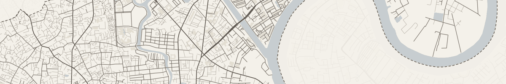
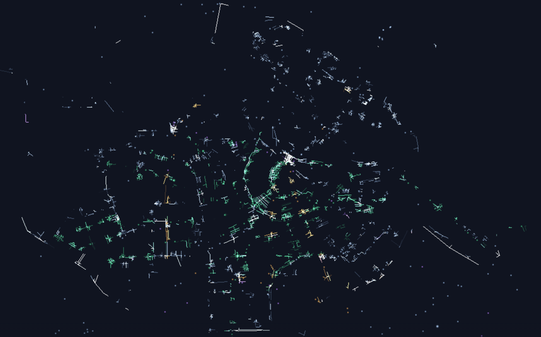
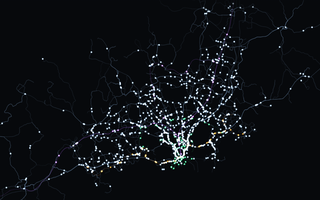
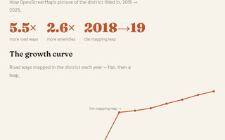
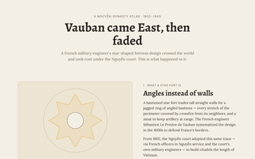
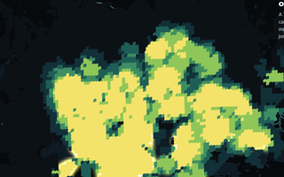
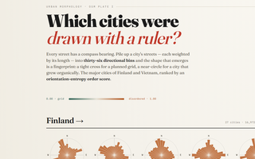

# Trần Long Châu

**Senior Data Engineer** — data platforms, lineage, reliability · Helsinki 🇫🇮



```python
>>> import longchau as lc
>>> lc.role
'Senior Data Engineer — platforms, lineage, reliability'
>>> lc.location
'Helsinki 🇫🇮'
>>> lc.fun            # NaN NaN NaN ... Batman!
['open data', 'maps', 'bilingual NLP']
```

---

I build and operate analytics data platforms for a living. Off the clock I don't really stop:

- **Open-data devotee** — I scrape, clean, and map Finnish & Vietnamese open data for fun, which I'm told is not a normal way to relax.
- **Bilingual bridge** — Vietnamese ↔ Finnish ↔ English. I once POS-tagged *Truyện Kiều* (Vietnam's national epic) because a Tuesday evening demanded it.
- **I learn by building in public** — and I follow Helsinki urban planning closely enough to grep the planning PDFs for underpasses. Cheerfully.

---

## Selected work

Nine of these are live. Three worth your time first:

<table>
<tr>
<td width="50%" valign="top">

[](https://ihsara.github.io/map-poster/web/poster.html)

### [Map Poster](https://ihsara.github.io/map-poster/web/poster.html) · `live`

Pick a place, a theme, and a print layout — export a poster-quality OSM map. Ships a curated catalog of **758 boundary-aware places across six Vietnamese cities**, each clipped to its real administrative outline, plus free-pan for anywhere else. WYSIWYG A0→A5 preview, Vietnamese-aware typography, headless render CLI.

*Shows: taking raw OSM all the way to a self-serve product — pipeline, cartography, front-end.*
[code](https://github.com/Ihsara/map-poster)

</td>
<td width="50%" valign="top">

[](https://ihsara.github.io/world-ripples/)

### [Cities, Breathing in Light](https://ihsara.github.io/world-ripples/) · `live` · `newest`

Every time a bus, tram, or train reaches a stop, a ripple spreads along the streets a rider could walk in three minutes. Where ripples overlap, the city's pulse brightens. Helsinki and Amsterdam, from the same city-agnostic pipeline.

*Shows: baked physics + WebGL2 playback, and a schema that survives a second city.*
[code](https://github.com/Ihsara/world-ripples)

</td>
</tr>
<tr>
<td colspan="2" valign="top">

[](https://ihsara.github.io/place-names/)

### [Fossils in the Map](https://ihsara.github.io/place-names/) · `live`

Where place-name *morphemes* cluster across Finland, Sweden, and Vietnam — a glowing scrollytelling map. Finland names the land it sees; Vietnam names the order it imposes. *Long* — dragon, prosperity — lights up 81 places on its own.

*Shows: turning bilingual NLP into a story you can read on a map.*
[code](https://github.com/Ihsara/place-names)

<br clear="left"/>

</td>
</tr>
</table>

### Also live

<table>
<tr>
<td width="33%" align="center">

[](https://ihsara.github.io/helsinki-ripples/)<br>
**[Helsinki, Breathing in Light](https://ihsara.github.io/helsinki-ripples/)**<br>
<sub>The original single-city ripple map, plus five A2 long-exposure poster plates. · [code](https://github.com/Ihsara/helsinki-ripples)</sub>

</td>
<td width="33%" align="center">

[](https://ihsara.github.io/helsinki-breathing/)<br>
**[Helsinki, Breathing](https://ihsara.github.io/helsinki-breathing/)**<br>
<sub>A morning of the HSL network: 5,384 vehicles as moving lights, passengers walking real streets. · [code](https://github.com/Ihsara/helsinki-breathing)</sub>

</td>
<td width="33%" align="center">

[](https://ihsara.github.io/binh-thanh-story/)<br>
**[Bình Thạnh, Filling In](https://ihsara.github.io/binh-thanh-story/)**<br>
<sub>A decade of one Saigon district appearing on OSM (2015→2025), off a live PostGIS history DB. · [code](https://github.com/Ihsara/binh-thanh-story)</sub>

</td>
</tr>
<tr>
<td width="33%" align="center">

[](https://ihsara.github.io/nguyen-citadels/)<br>
**[Vauban Came East, Then Faded](https://ihsara.github.io/nguyen-citadels/)**<br>
<sub>An atlas of 19 Nguyễn-dynasty star forts — traced from old plans onto their true sites. · [code](https://github.com/Ihsara/nguyen-citadels)</sub>

</td>
<td width="33%" align="center">

[](https://ihsara.github.io/fifteen-min-helsinki/)<br>
**[The 15-Minute Helsinki](https://ihsara.github.io/fifteen-min-helsinki/)**<br>
<sub>How many everyday needs sit within 15 minutes, by mode, across the city. · [code](https://github.com/Ihsara/fifteen-min-helsinki)</sub>

</td>
<td width="33%" align="center">

[](https://ihsara.github.io/street-orientations/)<br>
**[Street Orientations](https://ihsara.github.io/street-orientations/)**<br>
<sub>Boeing-style orientation roses for 5 Finnish vs 5 Vietnamese cities, scored by entropy. · [code](https://github.com/Ihsara/street-orientations)</sub>

</td>
</tr>
</table>

<details>
<summary><b>Other things I've built</b> — HPC tooling, a bureaucracy PWA, and open-data plumbing</summary>

<br>

| Project | What it is | Stack |
|---|---|---|
| [Pencil Platform](https://github.com/Ihsara/pencil-platform) | Campaign orchestration and analysis for Pencil Code simulations — a problem-agnostic core plus a consumer-plugin model, driving large MHD/hydro sweeps on SLURM HPC. | Python · SLURM · HPC |
| [LivingInFinland](https://github.com/Ihsara/finland_works) | A gamified PWA that walks newcomers through Finnish bureaucracy (Migri / DVV / Kela / Vero) with cultural context. | PWA · JS |
| [VN administrative boundaries](https://github.com/Ihsara/vietnam-administrative-boundary) | Clean reference lists/dicts for Vietnam's administrative reshuffles — the kind of tidy open-data plumbing I do for fun. | Python · open data |

</details>

---

**Currently:** building data platform tooling · tinkering with open-data + urban-data side projects.

[](https://linkedin.com/in/tranlongchau)
