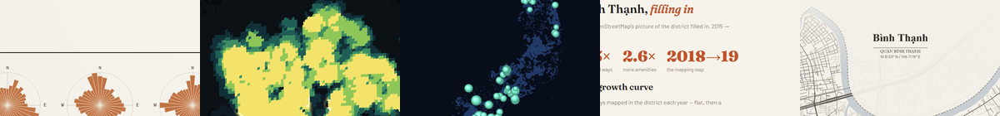
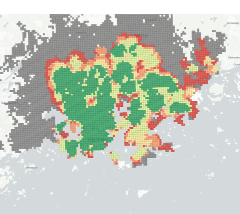

# Trần Long Châu

**Senior Data Engineer** — data platforms, lineage, reliability · Helsinki 🇫🇮



<sub>↑ from my own work: [Street Orientations](https://ihsara.github.io/street-orientations/) · [15-Minute Helsinki](https://ihsara.github.io/fifteen-min-helsinki/)</sub>

```python
>>> import longchau as lc
>>> lc.role
'Senior Data Engineer — platforms, lineage, reliability'
>>> lc.location
'Helsinki 🇫🇮'
>>> lc.fun            # NaN NaN NaN ... Batman!
['open data', 'maps', 'bilingual NLP']
```

---

I build and operate analytics data platforms for a living. Outside that:

- **Open-data devotee** — I scrape, clean, and map Finnish & Vietnamese open data for fun.
- **Bilingual bridge** — Vietnamese ↔ Finnish ↔ English (I once POS-tagged *Truyện Kiều* for the hell of it).
- **I learn by building in public**, and I follow Helsinki urban planning closely enough to grep the PDFs.

---

## Selected work

<table>
<tr>
<td width="50%" valign="top">

[](https://ihsara.github.io/fifteen-min-helsinki/)

### [15-Minute Helsinki](https://ihsara.github.io/fifteen-min-helsinki/) · `live`

How many everyday needs sit within 15 minutes — by mode — across Helsinki. Open geodata turned into an interactive map.
*Shows: turning messy open data into a platform people can actually use.*
[code](https://github.com/Ihsara/fifteen-min-helsinki)

</td>
<td width="50%" valign="top">

[](https://ihsara.github.io/street-orientations/)

### [Street Orientations](https://ihsara.github.io/street-orientations/) · `live`

Boeing-style street-orientation roses for 5 Finnish vs 5 Vietnamese cities, scored by orientation entropy.
*Shows: data that is both rigorous and nice to look at.*
[code](https://github.com/Ihsara/street-orientations)

</td>
</tr>
</table>

### More things I've built

| Project | What it is | Stack |
|---|---|---|
| [Pencil Code platform](https://github.com/Ihsara/pencil_platform) | Orchestrates large MHD/hydro parameter sweeps on SLURM HPC — YAML config-gen, job submission, automated error analysis, publication figures. | Python · SLURM · HPC |
| [LivingInFinland](https://github.com/Ihsara/finland_works) | A gamified PWA that walks newcomers through Finnish bureaucracy (Migri / DVV / Kela / Vero) with cultural context. | PWA · JS |
| [VN administrative boundaries](https://github.com/Ihsara/vietnam-administrative-boundary) | Clean reference lists/dicts for Vietnam's administrative reshuffles — the kind of tidy open-data plumbing I do for fun. | Python · open data |

---

**Currently:** building data platform tooling at Kesko · tinkering with open-data + urban-data side projects.

[](https://linkedin.com/in/tranlongchau)
[](mailto:longchau.tran@outlook.com)
