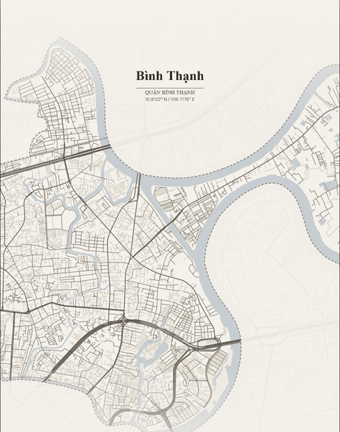
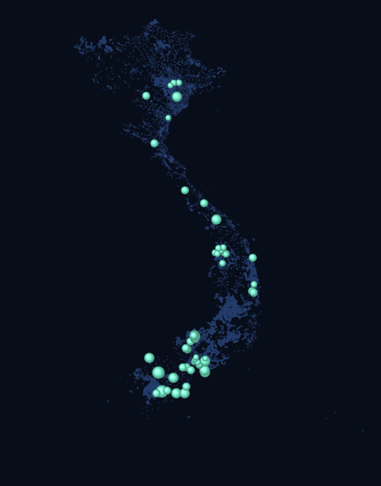
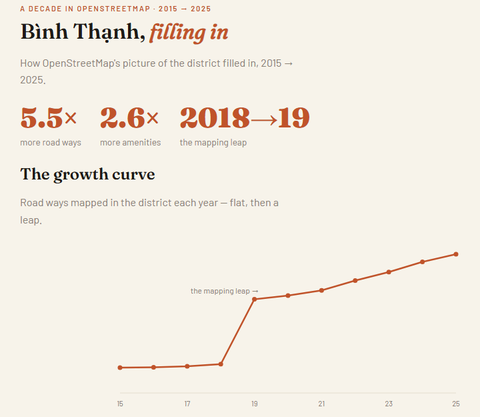

# Trần Long Châu

**Senior Data Engineer** — data platforms, lineage, reliability · Helsinki 🇫🇮


<sub>↑ from my own work: [Street Orientations](https://ihsara.github.io/street-orientations/) · [15-Minute Helsinki](https://ihsara.github.io/fifteen-min-helsinki/) · [Fossils in the Map](https://ihsara.github.io/place-names/) · [Bình Thạnh, filling in](https://ihsara.github.io/binh-thanh-story/) · [Map Poster](https://ihsara.github.io/map-poster/web/poster.html)</sub>

```python
>>> import longchau as lc
>>> lc.role
'Senior Data Engineer — platforms, lineage, reliability'
>>> lc.location
'Helsinki 🇫🇮'
>>> lc.fun            # NaN NaN NaN ... Batman!
['open data', 'maps', 'bilingual NLP']
```

---

I build and operate analytics data platforms for a living. Off the clock I don't really stop:

- **Open-data devotee** — I scrape, clean, and map Finnish & Vietnamese open data for fun, which I'm told is not a normal way to relax.
- **Bilingual bridge** — Vietnamese ↔ Finnish ↔ English. I once POS-tagged *Truyện Kiều* (Vietnam's national epic) because a Tuesday evening demanded it.
- **I learn by building in public** — and I follow Helsinki urban planning closely enough to grep the planning PDFs for underpasses. Cheerfully.

---

## Selected work

<table>
<tr>
<td colspan="2" valign="top">

[](https://ihsara.github.io/map-poster/web/poster.html)

### [Map Poster](https://ihsara.github.io/map-poster/web/poster.html) · `live` · `newest`

Pan anywhere on Earth, pick a place, a theme, and a print layout — and export a poster-quality OSM map. Ships **758 named areas across six Vietnamese cities** (wards + legacy districts), a WYSIWYG A0→A5 preview, Vietnamese-aware typography, and a headless render CLI. Keyless basemap (OpenFreeMap).
*Shows: taking raw OSM all the way to a polished, self-serve product — data pipeline, cartography, and front-end.*
[code](https://github.com/Ihsara/map-poster)

<br clear="left"/>

</td>
</tr>
<tr>
<td width="50%" valign="top">

[](https://ihsara.github.io/place-names/)

### [Fossils in the Map](https://ihsara.github.io/place-names/) · `live`

Where place-name *morphemes* cluster across Finland, Sweden, and Vietnam — a glowing scrollytelling map. Finland names the land it sees; Vietnam names the order it imposes.
*Shows: turning bilingual NLP into a story you can read on a map.*
[code](https://github.com/Ihsara/place-names)

</td>
<td width="50%" valign="top">

[](https://ihsara.github.io/binh-thanh-story/)

### [Bình Thạnh, filling in](https://ihsara.github.io/binh-thanh-story/) · `live`

A decade of one Saigon district filling in on OpenStreetMap (2015→2025) — roads, cafés, daily life — told as a guided data-story off a live PostGIS history DB.
*Shows: building a temporal geodata pipeline and making it readable.*
[code](https://github.com/Ihsara/binh-thanh-story)

</td>
</tr>
<tr>
<td width="50%" valign="top">

[](https://ihsara.github.io/fifteen-min-helsinki/)

### [15-Minute Helsinki](https://ihsara.github.io/fifteen-min-helsinki/) · `live`

How many everyday needs sit within 15 minutes — by mode — across Helsinki. Open geodata turned into an interactive map.
*Shows: turning messy open data into a platform people can actually use.*
[code](https://github.com/Ihsara/fifteen-min-helsinki)

</td>
<td width="50%" valign="top">

[](https://ihsara.github.io/street-orientations/)

### [Street Orientations](https://ihsara.github.io/street-orientations/) · `live`

Boeing-style street-orientation roses for 5 Finnish vs 5 Vietnamese cities, scored by orientation entropy.
*Shows: data that is both rigorous and nice to look at.*
[code](https://github.com/Ihsara/street-orientations)

</td>
</tr>
</table>

### More things I've built

| Project | What it is | Stack |
|---|---|---|
| [Pencil Code platform](https://github.com/Ihsara/pencil_platform) | Orchestrates large MHD/hydro parameter sweeps on SLURM HPC — YAML config-gen, job submission, automated error analysis, publication figures. | Python · SLURM · HPC |
| [LivingInFinland](https://github.com/Ihsara/finland_works) | A gamified PWA that walks newcomers through Finnish bureaucracy (Migri / DVV / Kela / Vero) with cultural context. | PWA · JS |
| [VN administrative boundaries](https://github.com/Ihsara/vietnam-administrative-boundary) | Clean reference lists/dicts for Vietnam's administrative reshuffles — the kind of tidy open-data plumbing I do for fun. | Python · open data |

---

**Currently:** building data platform tooling · tinkering with open-data + urban-data side projects.

[](https://linkedin.com/in/tranlongchau)
